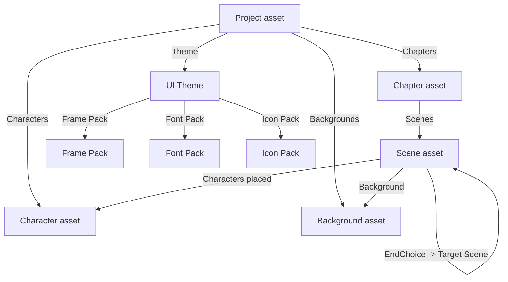

# What is a DataAsset?

VNFramework's design philosophy: **everything is a DataAsset — no Blueprints required for content.** This page explains what that means and why it matters.

## A DataAsset is a typed configuration file

In Unreal, a **DataAsset** is an asset whose only job is to hold settings. It has no behavior of its own — no logic, no events, no Begin Play. It's a row of fields you fill in via the editor's Details panel, saved as a `.uasset` file in your Content Browser.

You're already using DataAssets if you've ever:

- Tweaked a sound in a SoundCue.
- Configured a curve in a CurveTable.
- Set up a row in a DataTable.

VNFramework defines a small set of DataAsset types — Project, Chapter, Scene, Character, Background, UI Theme — and the *runtime* (a C++ subsystem you don't need to touch) reads them and drives the game.

!!! note
    Designers fill in fields. The framework reads them. There is no Blueprint scripting required to ship a complete visual novel.

## Why this matters

Compare two ways of authoring the same scene:

**Blueprint approach (not how VNFramework works):**

> Place a Blueprint actor in a level. Open its event graph. Wire `Begin Play → Set Background → Spawn Character → For Each Line → Show Dialogue → Wait For Input → ...`

**DataAsset approach (how VNFramework works):**

> Create a Scene asset. Fill in: background, character placements, dialogue lines. Done.

The DataAsset version is shorter, copy-pasteable, diff-friendly in version control, and lets non-programmers ship content without touching graphs.

## The hierarchy

VNFramework's DataAssets nest like Russian dolls. The **Project** is the root; everything else is referenced from it.

Reading top-to-bottom:

- **Project** holds everything: chapters in playback order, the cast, the location library, the theme, story-wide variables, default settings.
- **Chapter** groups scenes that go together. A chapter has a starting scene and (optionally) a next chapter.
- **Scene** is the unit of play: dialogue, characters, background, audio, transitions, end-of-scene flow.
- **Character / Background / Theme** are content libraries the project (and scenes) reference.

## References, not copies

When a Scene says "use background `B_Library`", it's storing a *reference* to the background asset — not a copy of its data. Edit `B_Library` and every scene using it picks up the change automatically. This is true everywhere references appear in VN data.

!!! tip
    Reuse aggressively. One character asset → used across every scene. One theme → controls colors project-wide. One background → reused in twelve scenes set in the same room.

## Soft references and load behavior

You'll see two kinds of asset references in the Details panel:

- **Hard reference** (the asset is loaded as soon as the asset that names it is loaded).
- **Soft reference** (the asset's *path* is stored; the asset only loads when the framework actively needs it).

VNFramework uses soft references almost everywhere — it lets a project of 200 scenes start up without loading all 200 backgrounds, characters, and audio clips into memory. The framework loads what it needs, when it needs it.

You don't have to think about this most of the time, but it's why setting a background on a scene doesn't immediately spike memory.

## What a DataAsset can't do

Because they're pure data, DataAssets can't:

- React to gameplay events directly (no Begin Play, no Tick).
- Run logic at runtime.
- Change their own values during play.

If you find yourself wanting any of that — "I want this character to *do* something custom" — you've crossed from designer territory into developer territory. The Developer track has separate docs for extending the framework.

For *content* — story, art, audio, choice flow — DataAssets are everything you need.

## Creating a DataAsset

The standard recipe in any VN content folder:

1. **Right-click in Content Browser → Miscellaneous → Data Asset.**
2. Pick the type from the asset picker (e.g. `VNSceneAsset`).
3. Name and save.

Or use **Visual Novel → Create New…** in the editor menu — it pre-fills sensible save paths.

## See also

- [Variables and scopes](variables-scopes.md) — DataAssets declare variables; the runtime stores their values.
- [Project asset reference](../reference/project-asset.md)
- [Chapter asset reference](../reference/chapter-asset.md)
- [Scene asset reference](../reference/scene-asset.md)
