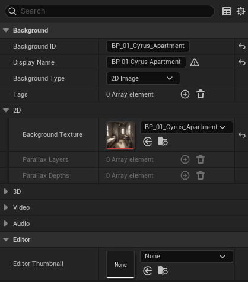

# Background asset reference

`UVNBackgroundAsset` defines a background — the back layer behind characters. Backgrounds can be 2D images, parallax layer stacks, references to a 3D level / world, or video (placeholder; not yet implemented). Each background can also carry an optional ambient sound that plays while it's active.

Create one per location. Reuse across every scene set in that location.

## Properties

### Identity

| Name | Type | Default | Used for |
|------|------|---------|----------|
| Background ID | Name | (empty) | Unique short ID. Convention: match the asset name. |
| Display Name | Text | (empty) | Friendly label (editor / debug). |
| Background Type | Enum | 2D Image | 2D Image, Parallax, 3D Scene, Video (not implemented). Controls which sub-fields apply. |

### 2D Image / Parallax

| Name | Type | Default | Used for |
|------|------|---------|----------|
| Background Texture | Texture | empty | The 2D image (used for both 2D Image and Parallax types as the base layer). |
| Parallax Layers | Array of Textures | empty | (Parallax only) Layer stack, back to front. |
| Parallax Depths | Array of Floats | empty | (Parallax only) Depth value per layer. `0` = no movement, `1` = full movement. |

### 3D Scene

| Name | Type | Default | Used for |
|------|------|---------|----------|
| Level Asset | World | empty | Level / world to load. |
| Streaming Level Name | Name | (empty) | Streaming level name (when bUseStreaming is on). |
| bUseStreaming | Bool | false | Use level streaming instead of full level load. |
| Camera Location | Vector | (0, 0, 100) | Initial camera position (used when there's no level sequence). |
| Camera Rotation | Rotator | (0, 0, 0) | Initial camera rotation. |
| Camera FOV | Float (30–120) | 90.0 | Field of view in degrees. |

### Video (not yet implemented)

| Name | Type | Default | Used for |
|------|------|---------|----------|
| Media Source | Object | empty | Media source asset. |
| bLoopVideo | Bool | true | Whether to loop. |

### Audio

| Name | Type | Default | Used for |
|------|------|---------|----------|
| Ambient Sound | Sound asset | empty | Optional ambient bed that plays while this background is active. |
| Ambient Volume | Float (0–1) | 1.0 | Volume scalar for the ambient sound. |

### Tags

| Name | Type | Default | Used for |
|------|------|---------|----------|
| Tags | Array of Names | empty | Free-form tags for filtering (e.g. `outdoor`, `night`, `chapter1`). |

## Common patterns

!!! example "A library reused across the chapter"
    Create `B_Library` with Background Type = 2D Image, set Background Texture, set Ambient Sound to a quiet room tone. Every scene set in the library references this asset. Edit `B_Library` once → every scene picks up the change.

!!! example "Parallax establishing shot"
    Background Type = Parallax. Author three layers: distant mountains, mid-ground trees, foreground grass. Set Parallax Depths to `[0.1, 0.3, 0.7]`. Camera or character motion shifts each layer by its depth value, producing a subtle 3D feel.

!!! example "Time-of-day variants"
    Author `B_Library_Day` and `B_Library_Night` as separate backgrounds. Different scenes (or per-line Background Change) pick the appropriate one. Sharing tags like `library` keeps them findable.

## Pitfalls

!!! danger "Video Background Type is a placeholder"
    The Video type appears in the enum but the renderer is not implemented. Don't ship using it.

!!! warning "Parallax Depths array length should match Parallax Layers"
    If you have three layers but only two depths, the third layer falls back to a default depth (typically 0 — static). Keep the arrays in sync.

!!! warning "Ambient Sound on a background vs. on a scene"
    Both can carry an ambient bed. The scene's ambient (when bChangeAmbient is on) takes precedence. Background-level ambient is the convenient default for "every scene in this library should have this room tone unless the scene says otherwise".

!!! warning "Backgrounds aren't auto-registered on the project"
    Like chapters and characters, you need to add backgrounds to the project asset's Backgrounds array if you want the validator to see them. Scenes can reference backgrounds whether or not they're in the project list — the registration is for tooling, not required for runtime.

## See also

- [Scene asset reference](scene-asset.md) — Background field and per-line Background Change.
- [Audio](../concepts/audio.md) — Ambient channel.
- [Transitions](../concepts/transitions.md) — animating background swaps.
