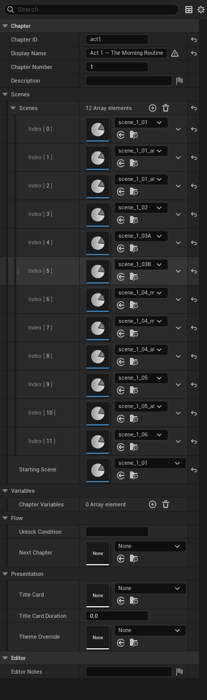

# Chapter asset reference

`UVNChapterAsset` groups related scenes into a chapter. A chapter has a starting scene, optional chapter-scoped variables, an optional title card, and an optional theme override.

## Properties

### Identity

| Name | Type | Default | Used for |
|------|------|---------|----------|
| Chapter ID | Name | (empty) | Unique ID. Match the asset name by convention. |
| Display Name | Text | (empty) | Friendly label (chapter selector UI, save list). |
| Chapter Number | Int | 1 | Ordering hint. Used by chapter selector UIs that sort. |
| Description | Text (multi-line) | (empty) | Author notes. |

### Scenes

| Name | Type | Default | Used for |
|------|------|---------|----------|
| Scenes | Array of Scene assets | empty | Every scene in this chapter. Add scenes here so the validator sees them. |
| Starting Scene | Scene asset | empty | Where the chapter begins on first entry. |

### Variables

| Name | Type | Default | Used for |
|------|------|---------|----------|
| Chapter Variables | Array of Variable definitions | empty | Reset when a *different* chapter loads. Use for per-chapter bookkeeping. |

### Flow control

| Name | Type | Default | Used for |
|------|------|---------|----------|
| Unlock Condition | String (expression) | (empty) | Expression that must be true to enter this chapter from a chapter-select UI. Empty = always unlocked. |
| Next Chapter | Chapter asset | empty | Continue here when this chapter ends (no scene's Next Scene set). Useful for linear projects. |

### Presentation

| Name | Type | Default | Used for |
|------|------|---------|----------|
| Title Card | Texture | empty | Optional image shown on chapter entry. |
| Title Card Duration | Float | 0.0 | Seconds to display the title card. `0` = skip. |
| Theme Override | UI Theme asset | empty | Replaces the project theme from when this chapter loads (so the title card uses it) until another chapter loads with its own override or no override (reverts to project theme). |

## Common patterns

!!! example "Linear story"
    Set each chapter's **Next Chapter** to the next chapter in reading order. The runtime auto-continues when a scene's Next Scene is empty and the scene ends.

!!! example "Branching story"
    Leave **Next Chapter** empty. Each scene's End Choice (or Conditional Next Scenes) explicitly points at the next scene — possibly in a different chapter — and the chapter never relies on auto-continue.

!!! example "Per-chapter visual style"
    Use **Theme Override** to swap the entire UI look for a flashback chapter (e.g. sepia-toned theme). Reverts when a chapter without an override loads.

!!! example "Locked epilogue"
    Set the epilogue chapter's **Unlock Condition** to `System.completed_main_story == true`. Any chapter selector UI will hide the entry until the player finishes the main game.

## Pitfalls

!!! danger "Scenes list and Starting Scene must agree"
    Setting Starting Scene to a scene not in the Scenes array works at runtime but breaks scene-selector UIs and the validator.

!!! warning "Chapter variables clear on chapter change"
    A Chapter-scoped variable in chapter 1 is gone when chapter 2 loads. If you need state to survive chapter transitions, use Story scope on the project asset instead.

!!! warning "Theme Override doesn't merge — it replaces"
    The override theme replaces the project theme entirely while the chapter is active. If your override is partially configured, the rest falls back to the framework's built-in defaults, not the project theme.

## See also

- [Build your first project](../getting-started/first-project.md) — adding chapters.
- [Project asset reference](project-asset.md)
- [Scene asset reference](scene-asset.md)
- [Variables and scopes](../concepts/variables-scopes.md)
- [Theme pack reference](theme-pack.md)
