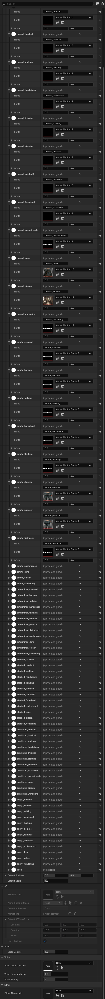

# Character asset reference

`UVNCharacterAsset` defines a character: who they are, how they're rendered (2D sprite, 3D skeletal mesh, or experimental Live2D / Spine), the expressions or animations they can play, and how their voice is mastered.

Create one per named character in your story. Reuse across every scene they appear in.

## Properties

### Identity

| Name | Type | Default | Used for |
|------|------|---------|----------|
| Character ID | Name | (empty) | Unique short ID. Dialogue lines reference this in Speaker ID. Match against Character Placement entries on scenes. |
| Display Name | Text | (empty) | Name shown in the dialogue box. |
| Name Color | Linear Color | white | Color for the speaker name (overrides theme default). |
| Character Type | Enum | 2D Sprite | 2D Sprite, 3D Skeletal, Live2D (future), Spine 2D (future). |

### 2D Sprite (when Character Type = 2D Sprite)

| Name | Type | Default | Used for |
|------|------|---------|----------|
| Default Expression | Name | (empty) | Expression name to use when none is specified. Must match an entry in Expressions. |
| Expressions | Array of Expression entries | empty | Each entry: Expression Name + Sprite (Texture) + optional Offset. |
| Default Position | Vector2 (0–1) | (0.5, 0.5) | Default screen position when no placement override is set. |
| Default Scale | Float | 1.0 | Default scale multiplier. |

### 3D Skeletal (when Character Type = 3D Skeletal)

| Name | Type | Default | Used for |
|------|------|---------|----------|
| Skeletal Mesh | Skeletal Mesh asset | empty | The character's 3D mesh. |
| Anim Blueprint Class | Anim Blueprint class | empty | Animation Blueprint to drive the mesh. |
| Default Animation | Name | (empty) | Animation name played when no override is given. Must match an entry in Animations. |
| Animations | Array of Animation entries | empty | Each entry: Animation Name + Anim Sequence + optional Montage + Looping flag + Blend In Time + Play Rate. |
| Default 3D Transform | Transform | identity | Default world transform for 3D placements. |
| bCastShadows | Bool | true | Whether the mesh casts shadows. |

### Audio (general)

| Name | Type | Default | Used for |
|------|------|---------|----------|
| Voice Volume | Float (0–2) | 1.0 | Per-character voice volume scalar. Master + Voice category volumes still apply. |

### Voice (advanced)

| Name | Type | Default | Used for |
|------|------|---------|----------|
| Voice Class Override | Sound Class | empty | Per-character SoundClass override. Empty = use the global Voice Sound Class from project settings. Useful for whispery / booming / radio-filter characters. |
| Voice Pitch Multiplier | Float (0.5–2.0) | 1.0 | Pitch scalar applied to all voice clips. 0.8 = gruffer; 1.2 = lighter. |
| Voice Priority | Int (0–10) | 5 | Higher wins concurrency conflicts. Narrator / unique characters: 7–9. |

### Tags

| Name | Type | Default | Used for |
|------|------|---------|----------|
| Tags | Array of Names | empty | Free-form tags for filtering / categorization (e.g. "main_cast", "antagonist"). Searchable in editor tooling. |

## Expression entry fields (2D)

| Field | Type | Default | Used for |
|-------|------|---------|----------|
| Expression Name | Name | (empty) | Short name (e.g. `happy`, `angry`, `surprised`). Referenced from per-line Character Changes. |
| Sprite | Texture | empty | The sprite for this expression. |
| Offset | Vector2 | (0, 0) | Optional offset from the default position. Useful when expression sprites have inconsistent framing. |

## Animation entry fields (3D)

| Field | Type | Default | Used for |
|-------|------|---------|----------|
| Animation Name | Name | (empty) | Short name (e.g. `idle`, `talking`, `wave`). |
| Animation | Anim Sequence | empty | The animation clip. |
| Montage | Anim Montage | empty | Optional montage for more complex behavior. |
| bLooping | Bool | true | Whether the animation loops. |
| Blend In Time | Float | 0.25 | Seconds to blend from previous animation. |
| Play Rate | Float | 1.0 | Playback speed multiplier. |

## Common patterns

!!! example "A standard 2D cast member"
    Character Type = 2D Sprite. Author 6–10 expressions (`neutral`, `smile`, `laugh`, `sad`, `angry`, `surprised`, `embarrassed`, `closed_eyes`). Set Default Expression = `neutral`. Done — every scene that places this character can call out any of those expression names.

!!! example "Narrator with no portrait"
    Don't make a character asset at all. Leave Speaker ID empty on dialogue lines — narration renders without a portrait, no character ID required.

!!! example "Voice-modulated villain"
    On the villain's character asset: Voice Pitch Multiplier 0.85, Voice Class Override pointing at a custom SoundClass with a low-shelf boost and reverb send. Every line they speak picks up the modulation automatically.

!!! example "Quiet narrator"
    Set Voice Volume to 0.7 on the narrator character. They'll consistently sit lower in the mix than the rest of the cast without per-line tuning.

## Pitfalls

!!! danger "Character ID must match Placement Character ID"
    A placement on a scene references a character via two fields: a soft pointer to the asset (Character) and a Character ID name. The runtime uses the Name. If the asset's Character ID is `hero` but the placement's Character ID is `Hero`, the framework treats them as different characters and the speaker name doesn't resolve.

!!! warning "Default Expression must exist in Expressions"
    Setting Default Expression to a name that isn't in the Expressions array means the character renders with no sprite. The validator warns about this.

!!! warning "Live2D and Spine character types are placeholders"
    Live2D and Spine 2D appear in the Character Type enum but the renderer for both is not yet implemented. Pick 2D Sprite or 3D Skeletal for shipping work.

!!! warning "Voice Pitch Multiplier affects clip duration"
    Pitching a voice clip changes how long it takes to play. If your auto-advance setting waits for voice, expect a 0.8× clip to take ~25% longer. Tune Auto Advance Delay accordingly.

## See also

- [Build your first scene](../getting-started/first-scene.md) — placing characters.
- [Audio](../concepts/audio.md) — voice channel, ducking, per-character tuning.
- [Scene asset reference](scene-asset.md) — character placements and per-line Character Changes.
