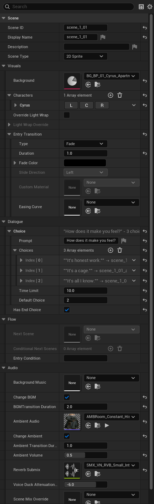

# Scene asset reference

`UVNSceneAsset` is the unit of play. A scene contains a background, a list of placed characters, an ordered list of dialogue lines, optional end-of-scene choices, audio configuration, and flow-control fields that decide what happens when the last line plays.

This is the asset designers spend most of their time in.

## Properties

### Scene identity

| Name | Type | Default | Used for |
|------|------|---------|----------|
| Scene ID | Name | (empty) | Unique scene identifier. Used by save / load and cross-scene refs. Match the asset name by convention. |
| Display Name | Text | (empty) | Human-readable label. Shown in debug overlays and selector UIs. |
| Description | Text (multi-line) | (empty) | Free-form author notes. Not shown to players. |
| Scene Type | Enum | 2D Sprite | Rendering mode: 2D Sprite, 2D Parallax, 3D Scene (experimental), Mixed (experimental). Controls which sub-fields apply. |

### Visuals

| Name | Type | Default | Used for |
|------|------|---------|----------|
| Background | Background asset | empty | Background shown when the scene loads. Mid-scene swaps are authored per-line. |
| Characters | Array of Character Placements | empty | Characters placed at scene load. Each placement: character ref, ID, initial expression, position, scale, layer, visibility, flip. |
| Config 3D | Struct | (default) | Level sequence + 3D character config. Only used when Scene Type is 3D Scene or Mixed. |
| bOverrideLightWrap | Bool | false | Override project-level light-wrap settings. |
| Light Wrap Override | Struct | (default) | Per-scene light-wrap tuning. Only active when bOverrideLightWrap is on. |
| Entry Transition | Struct | Fade, 0.5s, black | Transition played when entering this scene. |

### Dialogue

| Name | Type | Default | Used for |
|------|------|---------|----------|
| Dialogue Lines | Array of Dialogue Lines | empty | Lines in playback order. |
| End Choice | Struct | empty | Choice menu shown after the last line. Only visible when bHasEndChoice is true. |
| bHasEndChoice | Bool | false | If true, present End Choice after the last line. If false, auto-continue to Next Scene. |

### Flow control

| Name | Type | Default | Used for |
|------|------|---------|----------|
| Next Scene | Scene asset | empty | Scene to continue to automatically after the last line. Ignored when bHasEndChoice is on. |
| Conditional Next Scenes | Array | empty | Conditional diverts evaluated at scene-end *before* Next Scene. Array order matters — first truthy entry wins. |
| Entry Condition | String (expression) | (empty) | Must evaluate true for the scene to be entered. Empty = no gate. |

### Audio

| Name | Type | Default | Used for |
|------|------|---------|----------|
| Background Music | Sound asset | empty | BGM track for this scene. Empty + bChangeBGM unticked = inherit. |
| bChangeBGM | Bool | false | Apply the BGM setting on entry. Untick to inherit the previous scene's BGM. |
| BGM Transition Duration | Float | 1.0 | Seconds to crossfade BGM. `0` = hard cut. |
| Ambient Audio | Sound asset | empty | Ambient bed (room tone, wind, crowd). |
| bChangeAmbient | Bool | false | Apply Ambient Audio on entry. Untick to inherit. |
| Ambient Transition Duration | Float | 1.0 | Crossfade seconds for the ambient swap. |
| Ambient Volume | Float (0–1) | 1.0 | Per-scene ambient volume. Master + category volume still apply. |
| Reverb Submix | Sound Submix | empty | Reverb attached to the SFX + Voice submixes while this scene is active. Empty = no per-scene reverb. |
| Voice Duck Attenuation Db | Float (−24 to 0) | −6.0 | dB to duck Music + Ambient under Voice during this scene. `0` disables ducking just for this scene. |
| Scene Mix Override | Sound Mix | empty | Optional Sound Mix pushed for the duration of this scene (dream sequences, underwater, flashbacks). |

### Editor-only

| Name | Type | Default | Used for |
|------|------|---------|----------|
| Editor Notes | Text (multi-line) | (empty) | Author notes. Strip-cooked from shipping. |

## Dialogue Line fields (recap)

Each entry in **Dialogue Lines**:

| Field | What it does |
|-------|--------------|
| Speaker ID | Which character speaks. Empty = narrator. |
| Dialogue Text | The line itself. Multi-line, supports rich-text tags. |
| Voice Clip | Voice-over audio. Auto-plays when the line shows. |
| Character Changes | Per-character expression / position / scale / visibility / flip changes triggered on this line. |
| Speaker Name Override | Override the displayed speaker name just for this line. |
| Auto Advance + Auto Advance Delay | Continue automatically after N seconds. |
| Condition | Expression that must be true for the line to display. |
| Variable Assignments | One or more `Scope.var = expr` statements; fire when the line displays. |
| Background Change + Background Transition | Swap background mid-scene. |
| Ambient Change + bStopAmbient + Ambient Fade Duration | Swap or stop the ambient bed mid-scene. |
| Sound Effects | Array of one-shot SFX cues (sound, delay, volume, category, attenuation). |

## Common patterns

!!! example "A series of scenes in one location"
    On the first scene, set Background Music + bChangeBGM. Set Ambient + bChangeAmbient. On every subsequent scene in the same location, leave Background Music empty and **leave bChangeBGM unticked**. The framework keeps playing whatever was already running.

!!! example "Camera-cut beat without a separate scene"
    On a dialogue line: set Background Change to a different background, set Background Transition to Dissolve 0.3s. Cheaper than authoring two scenes for one shot.

!!! example "Cathedral / cave scene"
    Set Reverb Submix to a reverb-tagged Sound Submix asset. The reverb attaches to the SFX and Voice submixes while the scene is active and detaches automatically on scene end.

!!! example "Dream sequence with custom mastering"
    Set Scene Mix Override to a Sound Mix that boosts low-mids and dampens highs. Pushed for the scene duration; popped on exit.

## Pitfalls

!!! danger "bChangeBGM / bChangeAmbient default to OFF"
    A scene with Background Music set but bChangeBGM unticked silently inherits the previous scene's track. The most common "why isn't my new music playing?" cause.

!!! danger "Looping SFX cues stop on line advance"
    Every active SFX is killed when the dialogue advances. Use the Ambient channel for sustained noise — don't author a long Loop-category SFX expecting it to persist.

!!! warning "Conditional Next Scenes is checked *before* Next Scene"
    If you set both, the Conditional Next Scenes array runs first; Next Scene is the fallback. Order entries thoughtfully.

!!! warning "Character placement IDs must match character asset IDs"
    A placement with `Character ID = hero` only resolves to a character asset whose `Character ID` is also `hero`. Mismatch silently produces blank speaker names.

!!! warning "Voice Duck Attenuation Db only takes effect with bDuckAudioUnderVoice on"
    The player's audio settings have a master "duck under voice" toggle. If they turn it off, scene-level duck depth is ignored.

## See also

- [Build your first scene](../getting-started/first-scene.md)
- [Add your first choice](../getting-started/first-choice.md)
- [Audio](../concepts/audio.md)
- [Transitions](../concepts/transitions.md)
- [Expressions and conditions](../concepts/expressions.md)
- [Background asset reference](background-asset.md)
- [Character asset reference](character-asset.md)
