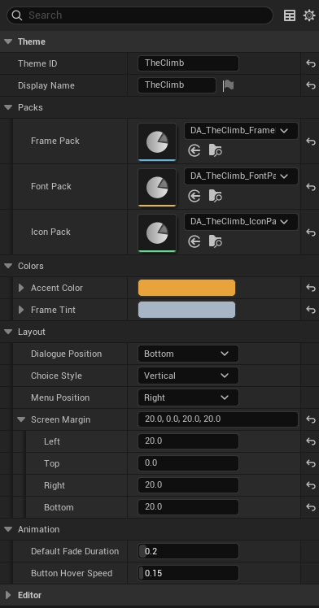

# Theme pack reference

A **UI Theme** controls the look of every VN screen — the dialogue box frame, the button shape, the body text font, the icons, the accent color. The framework splits theming into four assets:

- `UVNUITheme` — the master theme. References the three packs below.
- `UVNFramePack` — frame textures (9-slice borders, layered backgrounds, ornaments).
- `UVNFontPack` — font configurations for dialogue / name / UI / caption text.
- `UVNIconPack` — icon textures (continue indicator, save / load / settings icons, etc.).

A theme without packs still works — the framework ships sensible fallbacks. Adding packs gives you full visual control.

## UVNUITheme

The master asset. Reference one of these from your project asset's **Theme** field.

### Identity

| Name | Type | Default | Used for |
|------|------|---------|----------|
| Theme ID | Name | (empty) | Unique short ID. |
| Display Name | Text | (empty) | Friendly label. |

### Asset packs

| Name | Type | Default | Used for |
|------|------|---------|----------|
| Frame Pack | Frame Pack asset | empty | All frame visuals. Empty = use the color fallbacks below. |
| Font Pack | Font Pack asset | empty | All font configurations. Empty = use the color fallbacks below. |
| Icon Pack | Icon Pack asset | empty | All icon textures. Empty = no icons (or framework defaults where wired). |

### Colors

| Name | Type | Default | Used for |
|------|------|---------|----------|
| Accent Color | Linear Color | light blue (0.2, 0.6, 1.0) | Highlights, selection, focus indicators. |
| Frame Tint | Linear Color | white | Tint multiplied with every frame brush. Quick way to recolor an entire theme without editing the Frame Pack. |

### Color fallbacks (used only when no pack is set)

| Name | Type | Default | Used for |
|------|------|---------|----------|
| Background Color | Linear Color | dark navy (0.05, 0.05, 0.1, 0.9) | Panel fallback (when Frame Pack is unset). |
| Button Background Color | Linear Color | darker navy (0.1, 0.1, 0.15, 0.85) | Button fallback (when Frame Pack is unset). |
| Text Color | Linear Color | white | Body text fallback (when Font Pack is unset). |
| Text Shadow Color | Linear Color | black @ 0.7 alpha | Text shadow fallback. |
| Name Color | Linear Color | white | Speaker name fallback. |

These fields auto-hide once the relevant pack is assigned — the pack takes over.

### Layout

| Name | Type | Default | Used for |
|------|------|---------|----------|
| Dialogue Position | Enum | Bottom | Where the dialogue box sits (Top, Bottom, etc). |
| Choice Style | Enum | Vertical | Vertical or horizontal choice button stack. |
| Menu Position | Enum | Right | Quick menu side. |
| Screen Margin | Margin | 40 px all sides | Distance from screen edges to UI containers. |

### Animation

| Name | Type | Default | Used for |
|------|------|---------|----------|
| Default Fade Duration | Float | 0.2s | Default UI transition time. |
| Button Hover Speed | Float | 0.15s | Time for button hover animations. |

## UVNFramePack

Frame visuals. Has two modes — **Quick Setup** (default for new packs, ~15 fields, one border + background applied uniformly) and **Full Mode** (per-frame configuration with shared backgrounds, edges, ornaments, and indicators).

### Setup mode

| Name | Type | Default | Used for |
|------|------|---------|----------|
| bUseQuickSetup | Bool | true | Toggle between simplified Quick Setup and full per-frame configuration. |
| Quick Setup | Struct | (default) | One-stop config: border, background, optional corner ornament. Applied uniformly to all frame types. |

### Full Mode (when bUseQuickSetup is off)

Visible only with Quick Setup off. Sections include:

- **Shared Assets** — Default Background, Alternate Background, Button Background, Shared Edges (horizontal / vertical), Ornaments (corner, top bar, bottom bar, divider), Indicators (continue, focus, inner vignette).
- **Layered Frames** — full configurations for Dialogue, Name Plate, Choice Panel, Generic Panel, Backlog, Settings.
- **Button Borders** — simpler 9-slice borders for Choice and Menu buttons.
- **Auto Button State Generation** — checkbox to auto-generate hover / pressed / disabled states from the base frame using brightness multipliers (Hover 1.2×, Pressed 0.8×, Disabled 0.5× brightness + 0.6 alpha by default).
- **Custom Button State Overrides** — used only when auto-generation is off.

For most projects, Quick Setup + a Frame Tint on the theme is enough.

## UVNFontPack

Font configurations for four text types. Each entry uses an `FVNFontConfig` struct.

| Name | Used for |
|------|----------|
| Dialogue Config | Body dialogue text. |
| Name Config | Speaker name. |
| UI Config | Buttons, menus, settings labels. |
| Caption Config | Smaller / supporting text (timestamps, hints). |

Each config has:

| Field | Default | What it does |
|-------|---------|--------------|
| Font | (system default) | The Slate font (Typeface + size). |
| Text Color | white | Color for this text type. |
| bShadowEnabled | false | Whether to draw a drop shadow. |
| Shadow Offset | (2, 2) | Shadow pixel offset (when shadow is on). |
| Shadow Color | black @ 0.75 alpha | Shadow color. |

## UVNIconPack

Texture references for icons used by the UI.

### Playback icons

| Name | What it is |
|------|-----------|
| Continue Icon | "Click to advance" indicator on dialogue. |
| Auto Icon | Auto-mode toggle. |
| Skip Icon | Skip-mode toggle. |
| Pause Icon | Pause indicator. |

### Menu icons

| Name | What it is |
|------|-----------|
| Save Icon | Save menu / button. |
| Load Icon | Load menu / button. |
| Settings Icon | Settings menu / button. |
| Backlog Icon | History view. |
| Hide UI Icon | Hide-UI toggle. |
| Close Icon | Generic close. |

Plus more for genre-specific icons (lock, achievement, etc.) — open the asset and inspect.

## Common patterns

!!! example "Recolor an entire theme without re-authoring frames"
    Set Frame Tint on the theme to a saturated color. Every frame brush picks up the tint. Useful for a "memory" or "dream" overlay that should feel different without authoring a second frame pack.

!!! example "Lean theme for prototyping"
    Create a UI Theme with all packs left empty. Set Background Color, Text Color, Accent Color. The framework's fallbacks handle the rest — you get a fully usable visual layer with no art assets.

!!! example "Per-chapter look"
    Author two themes (`T_Default` and `T_Flashback`) with different fonts and tints. On the flashback chapter, set **Theme Override** to `T_Flashback`. Reverts on next chapter without an override.

!!! example "Shared packs across themes"
    Author one Frame Pack and one Icon Pack. Make three UI Themes that all reference them, differing only in colors / font pack / accent. Cheap visual variants with reusable assets.

## Pitfalls

!!! danger "Empty packs aren't an error"
    The framework will run with a theme that has no packs set — fallbacks render. But the result is intentionally minimal. For shipping, fill in at least Frame Pack and Font Pack.

!!! warning "Frame Tint multiplies, doesn't replace"
    If your Frame Pack uses a textured pink frame and you set Frame Tint to red, you get pink × red. Author neutral / white frames if you intend to recolor via tint.

!!! warning "Color fallbacks hide once a pack is set"
    The color-fallback fields (Background Color, Text Color, etc.) auto-hide when their corresponding pack is assigned. The pack takes over completely. To re-expose them, clear the pack reference.

!!! warning "Theme changes don't auto-rebuild running widgets"
    Switching theme mid-game (via chapter Theme Override) re-applies on the next widget-rebuild boundary. Most widgets pick it up on the next scene transition, but a custom widget you wrote in Blueprint may need to re-bind theme state explicitly.

## See also

- [Build your first project](../getting-started/first-project.md) — picking a theme.
- [Project asset reference](project-asset.md) — Theme field.
- [Chapter asset reference](chapter-asset.md) — Theme Override.
