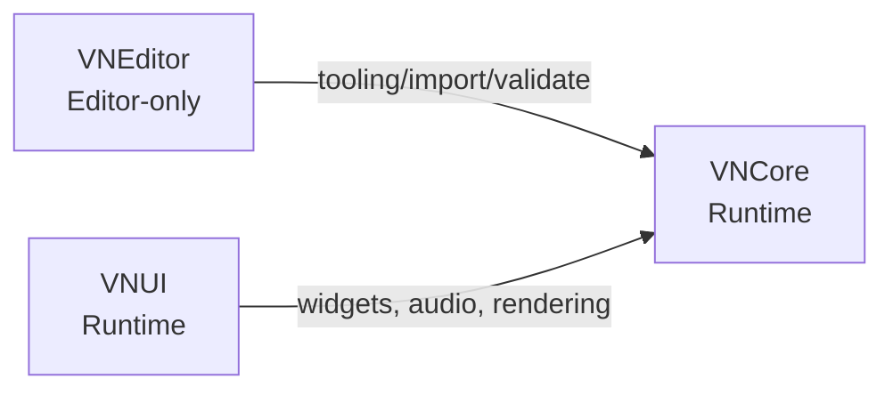
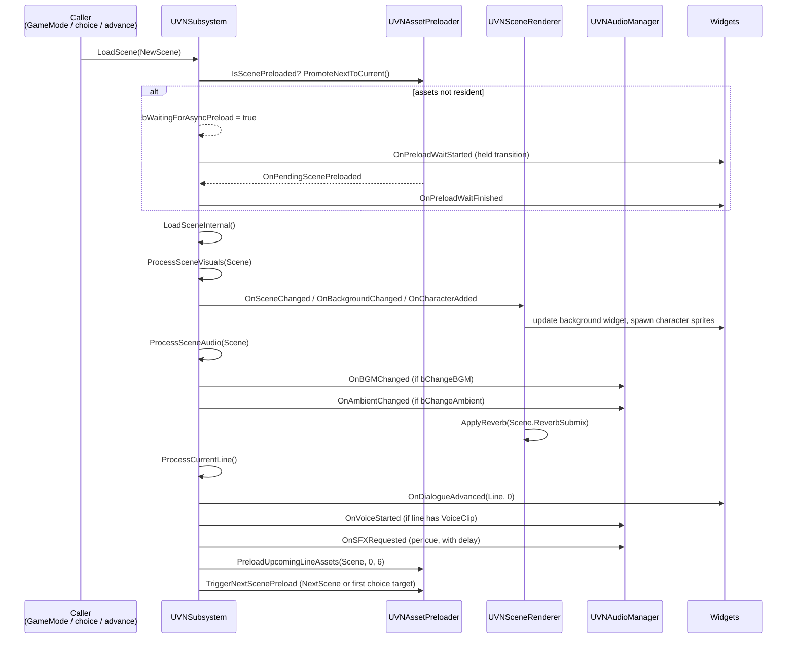
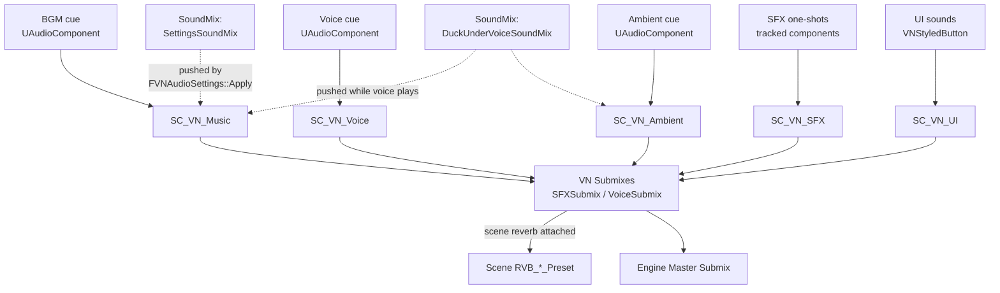

# Architecture

VNFramework is a three-module Unreal plugin built around a single
`GameInstanceSubsystem` that owns story state and broadcasts everything
the UI/audio/rendering layers need via multicast delegates.

## Module map

| Module | Build target | Depends on | Owns |
|---|---|---|---|
| **VNCore** | Runtime | — | DataAssets, `UVNSubsystem`, variables, expression evaluator, save games, `UVNFrameworkSettings`, `UVNAssetPreloader` |
| **VNUI** | Runtime | VNCore | Widgets, `UVNAudioManager`, `UVNSceneRenderer`, `UVNPlaybackController`, `UVNInputHandler`, `AVNGameModeBase` |
| **VNEditor** | Editor | VNCore (+ engine editor modules) | Asset editors, factories, Slate panels, Ink/Yarn/CSV importers, validators, detail customizations |

!!! warning "Dependency rule"
    `VNUI` and `VNEditor` may depend on `VNCore`. They MUST NOT depend on
    each other. There is no `VNCore -> VNUI` link — VNCore broadcasts via
    delegates, the UI layer subscribes. This keeps the runtime split clean
    and lets a project pull in just `VNCore` for headless tools.

## Runtime ownership

`AVNGameModeBase` is the conventional bootstrap. On `BeginPlay` it:

1. Resolves `UVNSubsystem` (a `UGameInstanceSubsystem`).
2. Constructs `UVNSceneRenderer`, `UVNAudioManager`, `UVNPlaybackController`,
   `UVNInputHandler` and stores them on the GameMode.
3. Creates the HUD widget tree (legacy `UUserWidget` mode) or pushes
   widgets through `UVNUIManagerSubsystem` (CommonUI mode, gated by
   `bUseCommonUIMode`).
4. Calls `UVNSubsystem::LoadProject(DefaultVNProject)`, which loads the
   theme, initialises variables, primes the asset preloader, and
   broadcasts `OnProjectChanged` / `OnThemeChanged`.

`UVNSubsystem` is the single source of story truth. Every other runtime
object is either a producer that calls into the subsystem, or a consumer
that binds to one of its multicast delegates.

## Scene-change data flow

A scene transition is the most fan-out-heavy operation in the system —
every visual, audio, and UI consumer reacts to it. Tracking it end to end
is the fastest way to grok the architecture.

The key entry points inside `VNSubsystem.cpp`:

- `LoadScene` / `LoadSceneAtLine` → guards re-entry, triggers async
  preload if needed, otherwise dispatches to `LoadSceneInternal`.
- `LoadSceneInternal` → calls `ProcessSceneVisuals`, `ProcessSceneAudio`,
  resets `CurrentLineIndex`, then `ProcessCurrentLine`.
- `ProcessSceneVisuals` → fires `OnBackgroundChanged`,
  `OnCharactersCleared`, then `OnCharacterAdded` per placement.
- `ProcessSceneAudio` → fires `OnBGMChanged` (when `bChangeBGM`) and
  `OnAmbientChanged` (when `bChangeAmbient`); calls
  `UVNAudioManager::StopAllSFX` indirectly via the line-advance hook.
- `ProcessCurrentLine` → applies the line's `BackgroundChange` /
  `AmbientChange` / `CharacterChanges`, calls `ProcessLineVoice`, fires
  `OnSFXRequested` per `FVNSoundCue`, broadcasts `OnDialogueAdvanced`.

`AdvanceDialogue` re-enters the same `ProcessCurrentLine` path; on
end-of-scene it consults `GetEffectiveNextScene` (which evaluates
`ConditionalNextScenes` in order) and recurses into `LoadScene`.

## Audio routing

Audio is plumbed through engine `SoundClass` and `SoundSubmix` assets so
the framework participates in standard UE mixer behavior. `UVNAudioManager`
spawns a small fixed pool of `UAudioComponent`s — one each for BGM, voice,
ambient, plus paired crossfade slots — and tracks one-shot SFX components
in `ActiveSFXComponents`.

Routing rules:

- All five `SoundClass` paths are read from `UVNFrameworkSettings`. There
  are no hardcoded paths in `VNAudioManager`, `VNSettingsTypes::Apply`,
  or `VNSceneRenderer::ApplyReverb`. Override per project in
  *Project Settings → Plugins → VNFramework*.
- `FVNAudioSettings::Apply` pushes `SettingsSoundMix` with class adjuster
  entries for the five categories. Setting volumes through
  `UVNSubsystem::SetMasterVolume` etc. flows through this path.
- `DuckUnderVoiceSoundMix` is pushed for the duration of voice playback
  when `FVNAudioSettings.bDuckAudioUnderVoice` is true.
- Per-scene reverb: `UVNSceneRenderer::ApplyReverb` attaches the scene's
  `ReverbSubmix` to the framework's SFX + Voice submixes, scaling the
  preset's authored `WetLevel` by `UVNFrameworkSettings::ReverbWetLevelMultiplier`
  (the original wet level is captured the first time so the multiplier
  always rescales against the authored value, not the previous).
- UI sounds (`VNStyledButton::ClickSound`/`HoverSound`) route through
  `SC_VN_UI` and never duck.

### 4-channel architecture

| Channel | Component(s) | SoundClass | Subsystem accessor | Volume on system save |
|---|---|---|---|---|
| BGM | `BGMComponent` + `BGMCrossfadeComponent` | `MusicSoundClass` | `Get/SetBGMVolume` | `BGMVolume` |
| Voice | `VoiceComponent` | `VoiceSoundClass` | `Get/SetVoiceVolume` | `VoiceVolume` |
| Ambient | `AmbientComponent` + `AmbientCrossfadeComponent` | `AmbientSoundClass` | `Get/SetAmbientVolume` | `AmbientVolume` |
| SFX | `ActiveSFXComponents[]` | `SFXSoundClass` | `Get/SetSFXVolume` | `SFXVolume` |

The fifth `UISoundClass` is NOT addressable via the subsystem — it is for
button hover/click cues that should always pin to master volume.

!!! info "SFX cleanup on advance"
    `UVNAudioManager::HandleDialogueAdvanced` (bound to `OnDialogueAdvanced`)
    calls `StopAllSFX()` every time the line cursor moves. Looping SFX
    cues authored with `EVNSfxCategory::Loop` therefore die at the next
    line — there is no author-visible "stop SFX" hook because line advance
    *is* the stop hook. If you need a sustained loop across multiple
    lines, route it through ambient.

## Developer settings (`UVNFrameworkSettings`)

`UVNFrameworkSettings` is a `UDeveloperSettings` exposed at
*Project Settings → Plugins → VNFramework*. It is the single place where
the framework's audio routing is bound to project-owned assets.

| Property | Type | Default points at | Used by |
|---|---|---|---|
| `MusicSoundClass` | `FSoftObjectPath` (USoundClass) | `/Game/VNFramework/Audio/SC_VN_Music` | BGM playback + volume |
| `VoiceSoundClass` | `FSoftObjectPath` (USoundClass) | `SC_VN_Voice` | Voice + volume |
| `AmbientSoundClass` | `FSoftObjectPath` (USoundClass) | `SC_VN_Ambient` | Ambient + volume |
| `SFXSoundClass` | `FSoftObjectPath` (USoundClass) | `SC_VN_SFX` | SFX + volume |
| `UISoundClass` | `FSoftObjectPath` (USoundClass) | `SC_VN_UI` | Button hover/click |
| `SettingsSoundMix` | `FSoftObjectPath` (USoundMix) | `SM_VN_Settings` | `FVNAudioSettings::Apply` |
| `DuckUnderVoiceSoundMix` | `FSoftObjectPath` (USoundMix) | `SM_VN_DuckUnderVoice` | Voice duck push/pop |
| `SFXSubmix` | `FSoftObjectPath` (USoundSubmix) | `Submix_VN_SFX` | Scene reverb attach |
| `VoiceSubmix` | `FSoftObjectPath` (USoundSubmix) | `Submix_VN_Voice` | Scene reverb attach |
| `ReverbWetLevelMultiplier` | `float` | `1.0` | Global scalar on every scene reverb preset |

A project that wants its own routing tree just points these properties at
its assets — no plugin source modification needed. See
[settings overrides](extending/settings-overrides.md).

## Async preloading

`UVNAssetPreloader` (owned by the subsystem) front-runs the reader using
`FStreamableManager`:

- Two-phase scene loads: primary DataAssets first, then nested textures
  inside those DataAssets (so a `BackgroundChange.BackgroundTexture` is
  resident before the crossfade widget asks for it).
- Rolling per-line window (default 6 lines) covers voice clips, mid-line
  background changes, ambient swaps, and every `FVNSoundCue` cue that
  would otherwise hit `LoadSynchronous` on the dialogue tick.
- Theme packs (FramePack/FontPack/IconPack) are pinned for the lifetime
  of the project so the GC never collects mid-game.
- Choice target preloading: when `OnChoicePresented` fires, target scenes
  for every visible choice are preloaded so a click never stalls.

When a scene is requested whose primary handle hasn't completed,
`UVNSubsystem` enters a "wait" state, broadcasts `OnPreloadWaitStarted`,
and the transition player holds at peak opacity. Preload completion
broadcasts `OnPreloadWaitFinished` and the transition is released.

## See also

- [VNCore API](api/vncore.md) — the subsystem and DataAssets in detail.
- [VNUI API](api/vnui.md) — widgets, renderer, audio manager.
- [Settings overrides](extending/settings-overrides.md) — pointing the
  framework at a project-specific audio tree.
