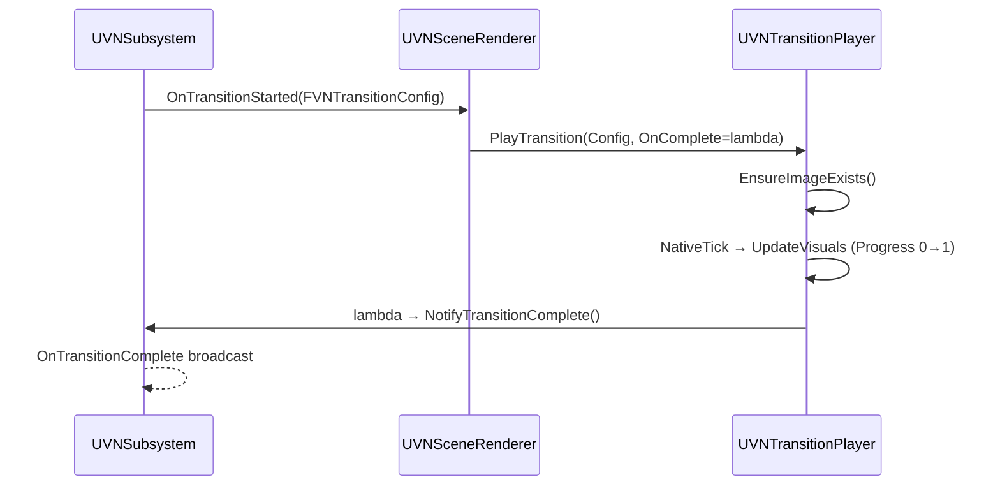

# Custom transitions

Scene-entry and per-line `BackgroundChange` transitions are dispatched
by `UVNTransitionPlayer` based on `FVNTransitionConfig::Type`.

## Current state

`EVNTransitionType` (in
`Plugins/VNFramework/Source/VNCore/Public/Data/VNSceneTypes.h`):

| Value | Status | What runs |
|---|---|---|
| `None` | Stable | Instant — no overlay change |
| `Fade` | Stable | `ApplyFadeTransition` — overlay alpha to `FadeColor`, then back |
| `Dissolve` | Stable | `ApplyDissolveTransition` — same path as Fade today |
| `Slide` | WIP | Falls back to Dissolve at runtime — no slide implementation yet |
| `Custom` | WIP | `ApplyCustomTransition` via dynamic material with a `Progress` parameter |

`FVNTransitionConfig` (same header):

| Field | Used by |
|---|---|
| `Type` | All |
| `Duration` | All non-`None` |
| `FadeColor` | `Fade` |
| `SlideDirection` | `Slide` (when implemented) |
| `CustomMaterial` | `Custom` |
| `EasingCurve` | All non-`None` (currently consulted in `UpdateVisuals` for the eased progress) |

## Dispatch flow



Inside `UVNTransitionPlayer::PlayTransition`:

1. `CurrentConfig = Config`, `bIsPlaying = true`, `Progress = 0`.
2. `EnsureImageExists()` — creates the overlay `UImage` if the BP didn't
   bind one.
3. `NativeTick` advances `Progress += DeltaTime / Config.Duration`.
4. `UpdateVisuals` applies the easing curve and dispatches based on
   `Config.Type`:
   - `None` → immediate complete.
   - `Fade` → set overlay color = `FadeColor`, alpha = peak triangle on
     `EasedProgress`.
   - `Dissolve` → same as Fade today.
   - `Custom` → `DynamicMaterial->SetScalarParameterValue("Progress", EasedProgress)`.
5. When `Progress >= 1`, `CompleteTransition()` calls
   `CompletionCallback` and resets state.

The hold-at-peak path (`SetHoldAtPeak` / `ReleaseHold`) clamps progress
at 0.5 so the overlay stays opaque while async preload runs. Released by
`HandlePreloadWaitFinished` on the renderer.

## Adding a new transition type

You have two options:

1. **Custom material** — author a material with a `Progress` parameter,
   set `Type = Custom` and `CustomMaterial = M_MyTransition` on the
   transition config, ship.
2. **First-class enum value** — add a new `EVNTransitionType` and
   teach `UVNTransitionPlayer` to dispatch on it.

The first option is the recommended path for one-off effects (e.g. an
iris wipe, a CRT-off horizontal squash). The second is for transition
families you want available everywhere.

### Option 2: first-class type

Steps, in order:

#### 1. Add the enum value

In `VNCore/Public/Data/VNSceneTypes.h`:

```cpp
UENUM(BlueprintType)
enum class EVNTransitionType : uint8
{
    None     UMETA(DisplayName = "None"),
    Fade     UMETA(DisplayName = "Fade"),
    Dissolve UMETA(DisplayName = "Dissolve"),
    Slide    UMETA(DisplayName = "Slide (WIP)"),
    Custom   UMETA(DisplayName = "Custom Material (WIP)"),
    Iris     UMETA(DisplayName = "Iris Wipe")  // <- new
};
```

If your transition needs extra config fields, add them to
`FVNTransitionConfig` with an `EditCondition` so they only show for
your type.

#### 2. Implement the dispatch

In `VNUI/Private/Rendering/VNTransitionPlayer.cpp` (mirroring the
existing `ApplyFadeTransition`):

```cpp
void UVNTransitionPlayer::UpdateVisuals()
{
    EasedProgress = ApplyEasing(Progress, CurrentConfig.EasingCurve);

    switch (CurrentConfig.Type)
    {
    case EVNTransitionType::None:
        Progress = 1.0f;
        break;
    case EVNTransitionType::Fade:
    case EVNTransitionType::Dissolve:
        ApplyFadeTransition();
        break;
    case EVNTransitionType::Custom:
        ApplyCustomTransition();
        break;
    case EVNTransitionType::Iris:           // <- new
        ApplyIrisTransition();
        break;
    default:
        ApplyFadeTransition();
        break;
    }
}

void UVNTransitionPlayer::ApplyIrisTransition()
{
    // Pull mask material, drive its 'Radius' parameter from EasedProgress.
    // The radius is a triangle wave: 0 → 1 → 0 over the transition,
    // matching how Fade pulses opacity.
    const float Tri = FMath::Min(EasedProgress, 1.0f - EasedProgress) * 2.0f;
    if (DynamicMaterial)
    {
        DynamicMaterial->SetScalarParameterValue("Radius", Tri);
    }
}
```

If you need a dedicated overlay material instead of reusing the existing
one, add a `TObjectPtr<UMaterialInterface>` field to `UVNTransitionPlayer`
and instantiate the dynamic material in `EnsureImageExists` /
`NativeConstruct`.

#### 3. Authoring surface

The new value is now available everywhere `FVNTransitionConfig` is
edited:

- `UVNSceneAsset::EntryTransition`
- `FVNDialogueLine::BackgroundTransition`

Designers don't need any further wiring — `OnTransitionStarted` already
flows through `UVNSceneRenderer::HandleTransitionStarted` to
`UVNTransitionPlayer::PlayTransition`.

#### 4. (Optional) Update validators

If your transition has required config (e.g. a mask material that must
be set when `Type == Iris`), extend `UVNAssetValidator::ValidateSceneAsset`
to flag a missing reference. See
[VNEditor API → Validation](../api/vneditor.md#validation).

## Why `Slide` and `Custom` are WIP

- `Slide` — the dispatcher falls through to `ApplyDissolveTransition`
  today. A real slide needs to translate the entire scene canvas (or
  capture-and-blit it), which the current overlay-only player doesn't
  do.
- `Custom` — `ApplyCustomTransition` is wired and works for any
  full-screen overlay material with a `Progress` scalar parameter, but
  there's no shipped sample material yet. If you implement one, place it
  under `/Game/VNFramework/Materials/Transitions/` and reference it from
  your `FVNTransitionConfig.CustomMaterial`.

## See also

- [Transitions concept](../../designers/concepts/transitions.md) — the
  designer view.
- [Architecture: scene-change data flow](../architecture.md#scene-change-data-flow)
  — where `OnTransitionStarted` fits in the broader sequence.
