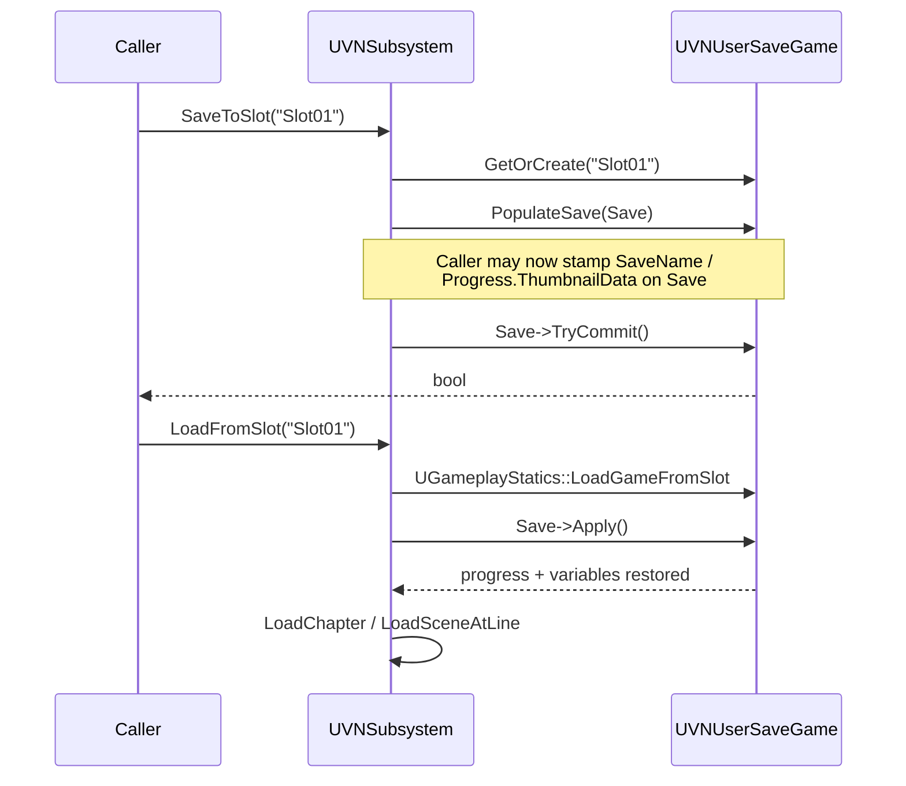

# Save system

VNFramework has two save game classes, both deriving from
`UVNBaseSaveGame`:

| Class | Slots | Lifetime | Purpose |
|---|---|---|---|
| `UVNUserSaveGame` | many (`MaxSaveSlots` on the project, default 20) + auto + quick | per playthrough | Story progress, story/chapter variables, backlog |
| `UVNSystemSaveGame` | one global slot | across all playthroughs | Read tracking, system variables, audio/video/gameplay settings |

## What goes where

### Persisted on `UVNUserSaveGame`

Header: `Save/VNUserSaveGame.h`.

| Field | Type | Notes |
|---|---|---|
| `Progress` | `FVNSaveProgress` | `ChapterPath`, `ScenePath`, `LineIndex`, `SaveTime`, `ThumbnailData` |
| `StoryVariables` | `FVNVariable` | Story-scope flags/numbers/strings |
| `ChapterVariables` | `FVNVariable` | Chapter-scope (reset on chapter change) |
| `SceneVariables` | `FVNVariable` | NOT `SaveGame` — transient, not persisted |
| `Backlog` | `TArray<FVNBacklogEntry>` | Recent dialogue history |
| `SaveName` | `FString` | User-provided slot label |
| `TotalPlaytimeSeconds` | `float` | Cumulative playtime |
| `SlotName` | `FString` (Transient) | Identifies the slot at runtime |

Inherited from `UVNBaseSaveGame`: `CreatedAt`, `UpdatedAt`, `SaveVersion`.

### Persisted on `UVNSystemSaveGame`

Header: `Save/VNSystemSaveGame.h`.

| Field | Type | Notes |
|---|---|---|
| `ReadLineIDs` | `TSet<FGuid>` | For "skip unread only" mode |
| `CompletedScenes` | `TSet<FName>` | Scene completion tracking |
| `UnlockedEndings` | `TSet<FName>` | Per-ending unlocks |
| `SystemVariables` | `FVNVariable` | System-scope vars (carry across saves) |
| `TextSpeed` | `float` (cps) | Text speed preference |
| `AutoAdvanceSettings` / `SkipSettings` | structs | Player auto/skip prefs |
| `MasterVolume` / `BGMVolume` / `SFXVolume` / `VoiceVolume` / `AmbientVolume` | `float` (0..1) | Volume sliders |
| `bFullscreen` | `bool` | Window mode |

## Save / load flow



`UVNSubsystem::PopulateSave` writes everything except widget-authored
fields (`SaveName`, `Progress.ThumbnailData`) so a save UI can prepare
the same `UVNUserSaveGame` instance that will be committed.

## Adding a new persisted field

### 1. Decide the scope

| Question | Answer → |
|---|---|
| Should it survive deleting the playthrough? | System save |
| Is it about player preferences / accessibility / read tracking? | System save |
| Is it part of the story state? | User save |
| Should the value reset when starting a new game? | User save |

### 2. Add the property

Mark it `SaveGame` so UE's save serializer picks it up.

```cpp
// VNUserSaveGame.h (or your subclass — see below)
UPROPERTY(SaveGame, BlueprintReadWrite, Category = "Save Game|Story")
TArray<FName> CollectedItems;
```

If you can't modify the framework class directly, derive your own:

```cpp
UCLASS(Blueprintable)
class MYGAME_API UMyGameSaveGame : public UVNUserSaveGame
{
    GENERATED_BODY()

public:
    UPROPERTY(SaveGame, BlueprintReadWrite, Category = "Save Game|Story")
    TArray<FName> CollectedItems;
};
```

…and override the GameMode bootstrap to use it (the simplest hook is to
write a Blueprint subclass of `UVNUserSaveGame` and wire your save UI
to it directly; the subsystem's own `SaveToSlot` always works on the
base class fields, so additional state is best loaded/saved through your
own helpers in parallel).

### 3. Populate on save

Hook into the subsystem's save flow. In `VNSubsystem.cpp`:

```cpp
void UVNSubsystem::PopulateSave(UVNUserSaveGame* Save) const
{
    if (!Save) return;
    Save->Progress.ChapterPath = CurrentChapter ? FSoftObjectPath(CurrentChapter) : FSoftObjectPath();
    Save->Progress.ScenePath   = CurrentScene   ? FSoftObjectPath(CurrentScene)   : FSoftObjectPath();
    Save->Progress.LineIndex   = CurrentLineIndex;
    // ... existing populate ...

    // Add yours:
    if (auto* MySave = Cast<UMyGameSaveGame>(Save))
    {
        MySave->CollectedItems = CollectedItemsRuntimeArray;
    }
}
```

If you don't want to touch the plugin, mirror this in your own subsystem
or game-mode helper that calls `Subsystem->PopulateSave(Save)` first and
then stamps your fields.

### 4. Restore on load

Mirror in `Apply` (or your own restore helper):

```cpp
void UVNUserSaveGame::Apply() const
{
    UVNSubsystem* Sub = /* ... */;
    Sub->ApplyVariables(StoryVariables, ChapterVariables);
    // ... existing apply ...

    if (const auto* MySave = Cast<UMyGameSaveGame>(this))
    {
        Sub->SetCollectedItems(MySave->CollectedItems);
    }
}
```

### 5. Bump `SaveVersion` and add migration

If your new field needs to populate sensibly for older saves, bump
`UVNBaseSaveGame::SaveVersion` and gate the read on it:

```cpp
void UVNUserSaveGame::Apply() const
{
    if (SaveVersion < 2)
    {
        // Old save — synthesise the new field from older fields.
        // e.g. CollectedItems was implicit in StoryVariables.
    }
    else
    {
        // Normal restore.
    }
}
```

Bump `SaveVersion` in the `Prepare`/`TryCommit` path so newly written
saves carry the new version.

## System save: adding a new tracking set

The `MarkLineAsRead` / `MarkSceneCompleted` / `MarkEndingUnlocked`
pattern is the model. To add (e.g.) item-collection tracking system-wide:

```cpp
// VNSystemSaveGame.h
UPROPERTY(SaveGame, BlueprintReadWrite, Category = "System Save|Tracking")
TSet<FName> DiscoveredLore;

UFUNCTION(BlueprintCallable, Category = "VN Framework|System Save")
void MarkLoreDiscovered(FName LoreID);

UFUNCTION(BlueprintCallable, Category = "VN Framework|System Save")
bool IsLoreDiscovered(FName LoreID) const;
```

Implement the helpers in the `.cpp` and call `TryCommit()` (or batch
commits) from your gameplay code.

## Slot management

`UVNUserSaveGame` provides static slot helpers:

| Method | Purpose |
|---|---|
| `IsValidSlotName(FString)` | Alphanumeric + underscore validation |
| `GetOrCreate(FString)` | Load existing or instantiate new |
| `DoesExist(FString)` | True if file present |
| `TryDelete(FString)` | Remove (returns true if deleted or didn't exist) |
| `GetAllSlotNames(TArray<FString>&)` | Enumerate every slot file matching the prefix |

Reserved slot names (defined as static constants on `UVNSubsystem`):

- `UVNSubsystem::AutoSaveSlotName` — used by `AutoSave()`
- `UVNSubsystem::QuickSaveSlotName` — used by `QuickSave()` / `QuickLoad()`

## Testing notes

- Save files live under `Saved/SaveGames/` in the project folder during
  PIE / editor play, and the platform's save directory in shipping
  builds.
- Delete a save during testing with `TryDelete(SlotName)` rather than
  removing the file by hand — the in-memory state in the subsystem
  needs to be re-synced.
- The system save is named via `UVNSystemSaveGame::GetSystemSlotName()`
  (private). Touch it via `Subsystem->GetSystemSave()` rather than
  loading directly.
